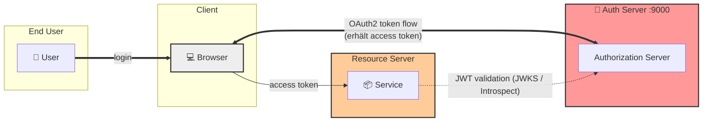

# Spring Framework 6: Beginner to Guru

## spring-6-auth-server


```mermaid
flowchart LR
    subgraph AuthServer["🔑 Auth Server :9000"]
        Auth["Authorization Server"]
    end

    subgraph ClientSide["Client"]
        Browser["💻 Browser"]
    end

    subgraph ResourceSide["Resource Server"]
        Service["📦 Service"]
    end

    subgraph UserSide["End User"]
        User["👤 User"]
    end

    User ===>|"login"| Browser
    Browser <==>|"OAuth2 token flow<br/>(erhält access token)"| Auth
    Browser -->|"access token"| Service
    Service -.->|"JWT validation (JWKS / Introspect)"| Auth

    style AuthServer fill:#ff9999,stroke:#333,stroke-width:2px
    style ResourceSide fill:#ffcc99,stroke:#333,stroke-width:2px
    style Browser fill:#eeeeee,stroke:#333,stroke-width:2px
```

## Getting Started:

Server runs on port 9000/30900

## Sandbox

Initial setup (one-time, allow sandbox kit sources):

```powershell
sbx settings set kit.allowedSources --% "[\"docker.io/\",\"github.com/dboeckli/\"]"
```

Add the sandbox kit:

```powershell
sbx kit add git+https://github.com/dboeckli/opencode-sandbox-kit.git#dir=opencode-agent
```

Start the sandbox (usually from PowerShell):

```powershell
sbx run opencode --name spring-6-auth-server --kit "git+https://github.com/dboeckli/opencode-sandbox-kit.git#dir=opencode-agent" "C:\development\projects\spring-6-auth-server"
```

Start the sandbox with Kubernetes support:

```powershell
sbx run opencode --name spring-6-auth-server --kit "git+https://github.com/dboeckli/opencode-sandbox-kit.git#dir=opencode-agent" "C:\development\projects\spring-6-auth-server" "$env:USERPROFILE\.kube:ro"
```

Start the sandbox from WSL:

```bash
opencode --name spring-6-auth-server --kit "git+https://github.com/dboeckli/opencode-sandbox-kit.git#dir=opencode-agent" "/mnt/c/development/projects/spring-6-auth-server"
```

Remove the sandbox:

```powershell
sbx remove spring-6-auth-server
```

## Swagger/Open Api

- http://localhost:9000/swagger-ui/index.html
- http://localhost:30900/swagger-ui/index.html

## Project Structure:

`pom.xml`: This is your main Maven configuration file. It manages dependencies, plugins, and build settings.
`src` Directory: Contains your main Java source code and resources, as well as test code.
`restRequest` Directory: Houses resources for REST requests, including authentication HTTP requests and HTTP client configurations.

## Docker

### create image

```shell
.\mvnw clean package spring-boot:build-image
```

or just run

```shell
.\mvnw clean install
```

### run image

Hint: remove the daemon flag -d to see what is happening, else it run in background

```shell
docker run --name auth-server -d -p 9000:9000 spring-6-auth-server:0.0.1-SNAPSHOT
docker stop auth-server
docker rm auth-server
docker start auth-server
```

## Deployment with Kubernetes

Deployment goes into the default namespace.

To deploy all resources:

```bash
kubectl apply -f target/k8s/
```

To remove all resources:

```bash
kubectl delete -f target/k8s/
```

Check

```bash
kubectl get deployments -o wide
kubectl get pods -o wide
```

You can use the actuator rest call to verify via port 30900

## Deployment with Helm

Be aware that we are using a different namespace here (not default).

For details on how the Helm chart is built via Maven filtering and how Docker/Helm versions are derived, see [docs/helm-maven-setup.md](docs/helm-maven-setup.md).

Go to the directory where the tgz file has been created after 'mvn install'

```powershell
cd target/helm/repo
```

unpack

```powershell
$file = Get-ChildItem -Filter *.tgz | Select-Object -First 1
tar -xvf $file.Name
```

install

```powershell
$APPLICATION_NAME = Get-ChildItem -Directory | Where-Object { $_.LastWriteTime -ge $file.LastWriteTime } | Select-Object -ExpandProperty Name
helm upgrade --install $APPLICATION_NAME ./$APPLICATION_NAME --namespace spring-6-auth-server --create-namespace --wait --timeout 5m --debug  --render-subchart-notes
```

show logs

```powershell
kubectl get pods -l app.kubernetes.io/name=$APPLICATION_NAME -n spring-6-auth-server
```

replace $POD with pods from the command above

```powershell
kubectl logs $POD -n spring-6-auth-server --all-containers
```

test

```powershell
helm test $APPLICATION_NAME --namespace spring-6-auth-server --logs
```

uninstall

```powershell
helm uninstall $APPLICATION_NAME --namespace spring-6-auth-server
```

delete all

```powershell
kubectl delete all --all -n spring-6-auth-server
```

create busybox sidecar

```powershell
kubectl run busybox-test --rm -it --image=busybox:1.36 --namespace=spring-6-auth-server --command -- sh
```

You can use the actuator rest call to verify via port 30900

