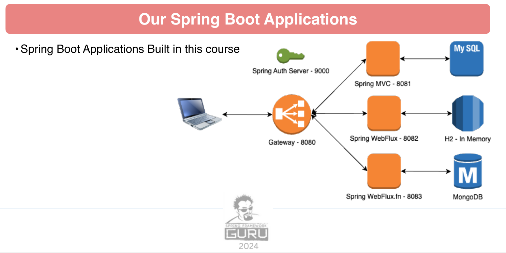

# Spring Framework 6: Beginner to Guru

## spring-6-auth-server



## Getting Started:
Server runs on port 9000/30900.

## Swagger/Open Api 

- http://localhost:9000/swagger-ui/index.html
- http://localhost:30900/swagger-ui/index.html

## Project Structure:
`pom.xml`: This is your main Maven configuration file. It manages dependencies, plugins, and build settings.
`src` Directory: Contains your main Java source code and resources, as well as test code.
`restRequest` Directory: Houses resources for REST requests, including authentication HTTP requests and HTTP client configurations.

## Docker

### create image
```shell
.\mvnw clean package spring-boot:build-image
```
or just run
```shell
.\mvnw clean install
```

### run image

Hint: remove the daemon flag -d to see what is happening, else it run in background

```shell
docker run --name auth-server -d -p 9000:9000 spring-6-auth-server:0.0.1-SNAPSHOT
docker stop auth-server
docker rm auth-server
docker start auth-server
```
## Deployment with Kubernetes

Deployment goes into the default namespace.

To deploy all resources:
```bash
kubectl apply -f target/k8s/
```

To remove all resources:
```bash
kubectl delete -f target/k8s/
```

Check
```bash
kubectl get deployments -o wide
kubectl get pods -o wide
```

You can use the actuator rest call to verify via port 30900

## Deployment with Helm

Be aware that we are using a different namespace here (not default).

Go to the directory where the tgz file has been created after 'mvn install'
```powershell
cd target/helm/repo
```

unpack
```powershell
$file = Get-ChildItem -Filter *.tgz | Select-Object -First 1
tar -xvf $file.Name
```

install
```powershell
$APPLICATION_NAME = Get-ChildItem -Directory | Where-Object { $_.LastWriteTime -ge $file.LastWriteTime } | Select-Object -ExpandProperty Name
helm upgrade --install $APPLICATION_NAME ./$APPLICATION_NAME --namespace spring-6-auth-server --create-namespace --wait --timeout 5m --debug
```

show logs
```powershell
kubectl get pods -l app.kubernetes.io/name=$APPLICATION_NAME -n spring-6-auth-server
```

replace $POD with pods from the command above
```powershell
kubectl logs $POD -n spring-6-auth-server --all-containers
```

test
```powershell
helm test $APPLICATION_NAME --namespace spring-6-auth-server --logs
```

uninstall
```powershell
helm uninstall $APPLICATION_NAME --namespace spring-6-auth-server
```

You can use the actuator rest call to verify via port 30900

